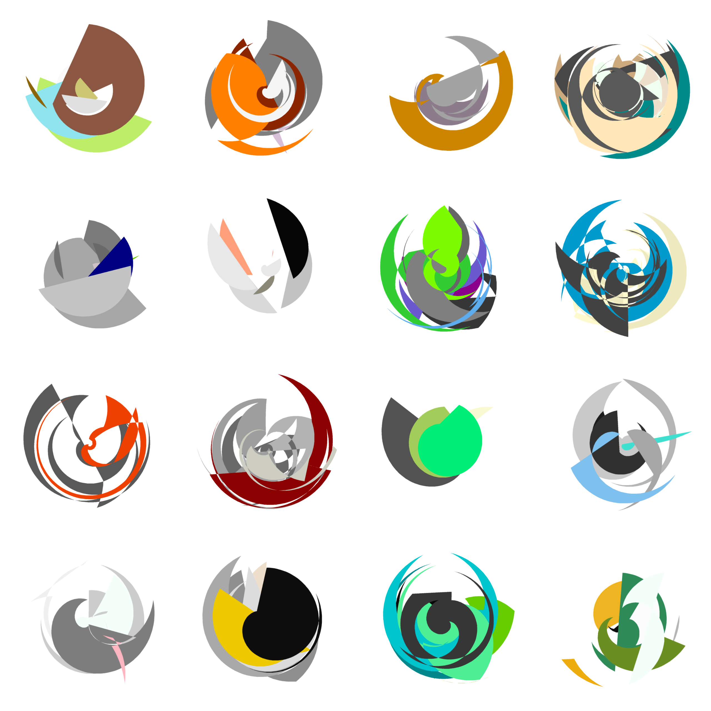

## Generative Art by Ven Popov

Just started experimenting with generative art. As of now, the `rswirl` function is the only one. It randomly generates N polygons each with M vertices. Each polygon I fill with a random color. At this point the results are not very nice, but next step is I warp the whole image from cartesian to polar coordinates, which causes the polygons to become swirls. I generate thousands of these, and then select the ones that I like most! Here's an example:

